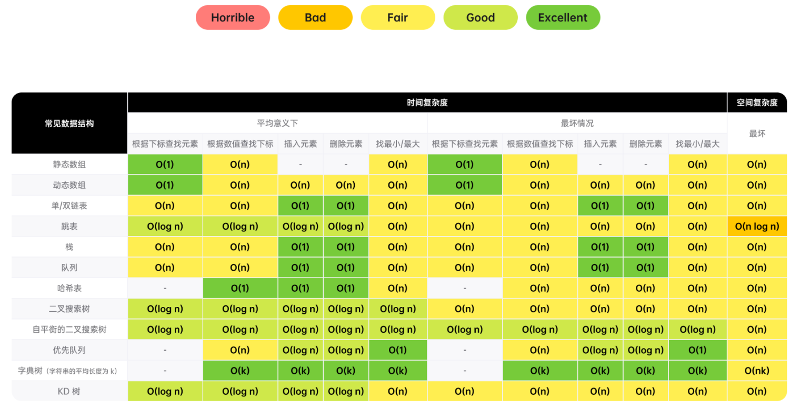

## Key point
### time complexity
1.array

2.string

3.link

4.hash/dictionary

5.set

6.stack

7.queue

8.binary tree(DFS,BFS)

9.binary search

10.heap/queue

11.binary search

12.else



### input and time complexity
the constrain can be seen as a prompt, because it indicate the limit of the time complexity.
1. n <= 10
基数大于2的阶乘或指数，如$O(n^2·n!) $ or $O(4^n)$
consider trace or other brute force recursive algorithm
[in fact every algorithm that can find the answer is fast enough] 
2. 10 < n <= 20
$O(2^n)$
trace or recursive algorithm
3. 20 < n <= 100
$O(n^3)$ simole question in leetcode
consider solution related to a nested loop
if you have put forward a brute solution, please trying to figure out which step is slow
try to use hash map or heap tools to improve
4. 100 < n < 1,000
$O(n^2)$
nested loop
$O(n^2)$ is usually the best/expected time algorithm in this range
5. 1,000 < n < 100,000
**most often seen constrain**
$O(n·log n)$, although $O(n)$ is more common
6. 100,000 < n < 1,000,000
It is a less common constrain, which requires a complexity of $O(n)$, in this range, $O(n·log n)$ is safety
may need hash map sometimes
7. 1,000,000 < n
for huge input, the most common accepteable time complexity is $O(log n)$ or $O(1)$


## Template
### 1. Double points
case1
```cpp
int fn(vector<int>& arr){
    int left = 0;
    int right = int(arr.size()) -1;
    int ans = 0;

    while(left < right){
        if(CONDITION){
            //necessary code
            left++;
        }
        else{
            right++;
        }
    }
    return ans;
}
```

```python
def fn(arr):
    left = ans = 0
    right = len(arr) - 1

    while left < right:
        #necessary code
        left += 1
    else:
        right -= 1
    return ans
```
case 2

```cpp
int fn(vector<int>& arr1, vector<int>& arr2){
    int i = 0, j = 0, ans = 0;

    while(i < arr1.size() && j < arr2. size()){
        if(CODITION){
            i++;
        }else{
            j++;
        }
    }

    while(i < arr1.size()){
        i++;
    }
    
    while(j < arr2.size()){
        j++;
    }

    return ans;
}
```

```python
def fn(arr1, arr2):
    i = j = ans = 0

    while i < len(arr1) and j < len(arr2):
        i += 1
    else:
        j += 1

    while i < len(arr1):
        i += 1
    while j < len(arr2):
        j += 1
    return ans
```
### 2.Sliding windows
```cpp
int fn(vector<int>& arr){
    int left = 0, ans = 0, curr = 0;
    
    for(int right = 0; right < arr.size(); right++){
        //adding code to add "arr[right]" to "curr"
        while(WINDOW_CONDITION_BROKEN){
            //delete "arr[left]" from "curr"
            left++;
        }
        //update ans
    }
    return ans;
}
```

```python
def fn(arr):
    left = ans = curr = 0

    for right in range(len(arr)):
    //adding code to add "arr[right]" to "curr"
        while WINDOW_CONDITION_BROKEN:
            left += 1
            //update ans
    return ans
```

### 3. Build the prefix "and"
```cpp
vector<int> fn(vector<int>& arr){
    vector<int> prefix(arr.size());
    prefix[0] = arr[0];

    for(int i = 1; i < arr.size(); i++){
        prefix[i] = prefix[i - 1] + arr[i];
    }

    return prefix;
}
```

```python
def fn(arr):
    prefix = [arr[0]]
    for i in range(1, len(arr)):
        prefix.append(prefix[-1] + arr[i])

    return prefix
```

### 4. High efficiency string construct
```cpp
string fn(vector<char>& arr){
    return string(arr.begin(), arr.end())
}
```

```python
def fn(arr):
    ans = []
    for c in arr:
        ans.append(c)
    return "".join(ans)
```

### 5. Link: fast and slow points
```cpp
int fn(ListNode* head){
    ListNode* slow = head;
    ListNode* fast = head;
    int ans = 0;

    while(fast != nullptr && fast->next != nullptr){
        //necessary code
        slow = slow->nest;
        fast = fast->nest->next;
    }

    return ans;
}
```

```python
def fn(head):
    slow = head
    fast = head
    ans = 0

    while fast and fast.next:
        #necessary code
        slow = slow.next
        fast = fast.next.next

    return ans

```

### 6. Reverse link
```cpp
ListNode* fn(ListNode* head){
    ListNode* curr = head;
    ListNode* prev = nullptr;
    while (curr != nullptr){
        ListNode* nextNode = curr->next;
        curr->next = prev;
        prev = curr;
        curr = nextNode;
    }

    return prev;
}
```

```python
def fn(head):
    curr = head
    prev = None
    while curr:
        nextNode = curr.next
        curr.next = prev
        prev = curr
        curr = nextNode
    return prev
```

### 7.find the exact array number
```cpp
int fn(std::vector<int>& arr, int k){
    std::unordered_map<int, int> counts;
    counts[0] = 1;
    int ans = 0, curr = 0;

    for(int num: arr){
        // change curr based on the problem
        ans += counts[curr - k];
        counts[curr]++;
    }
    
    return ans;
}
```

```python
from collections import defaultdict

def fn(arr, k):
    counts = defaultdict(int)
    counts[0] = 1
    ans = curr = 0

    from num in arr:
        # change curr based on the problem

```
###  8. monotonically incremental
```cpp
int fn(std::vector<int>& arr) {
    std::stack<int> stack;
    int ans = 0;

    for (int num: arr) {
        // decrease change the compare sign
        while (!stack.empty() && stack.top() > num) {
            // 根据题意补充代码
            stack.pop();
        }

        stack.push(num);
    }
}

```

```python
def fn(arr):
    stack = []
    ans = 0

    for num in arr:
        # change > to < when necessary
        while stack and stack[-1] > num:
            # complete the code
            stack.pop()
        stack.append(num)
    
    return ans
```

### 9.Binary tree / Deep First Search (recursive)
```cpp
int dfs(TreeNode* root){
    if(root == nullptr){
        return 0;
    }
    int ans = 0;
    //complete the code
    dfs(root.left);
    dfs(root.right);
    return ans;
}
```

```python
def dfs(root):
    if not root:
        return
    ans = 0
    #complete code
    dfs(root.left)
    dfs(root.right)
    return ans
```

### 10.Binary tree / Deep First Search (iteration)
```cpp
int dfs(TreeNode* root){
    stack<TreeNode*> stack;
    stack.push(root);
    int ans = 0;

    while(!stack.empty()){
        TreeNode* node = stack.top();
        stack.pop();
        //complete the code
        if(node->left != nullptr){
            stack.push(node->left);
        }
        if(node->right != nullptr){
            stack.push(node->right);
        }
    } 
    return ans;
}
```
### 11.Binary tree / Breath First Search
```cpp
int fn(TreeNode* root){
    queue<TreeNode*> queue;
    queue.push(root);
    int ans = 0;

    while(!queue.empty()){
        int currentLength = queue.size();

        for (int i = 0; i < currentLength; i++){
            TreeNode* node = queue.front();
            queue.pop();
            //based on the question to complete the code
            if(node->left != nullptr){
                queue.push(node->left);
            }
            if(node->right != nullptr){
                queue.push(node->right);
            }
        }
    }
    return ans;
}
```

```python
from collections import deque

def fn(root):
    queue = deque([root])
    ans = 0

    while queue:
        currentLength = len(queue)
        #do current operation
        for _ in range(currentLength):
            node = queue.popleft()
            if node.left:
                queue.append(node.left)
            if node.right:
                queue.append(node.right)
    return ans

```
### 12.Graph / Depth First Search (recursive)
assume the node number range from 0 to n-1
the graph is given with the format of graph
```cpp
unordered_set<int> seen;
int fn(vector<vector<int>>& graph){
    seen.insert(START_NODE);
    return dfs(START_NODE, graph);
}

int fn dfs(int node, vector<vector<int>>& graph){
    int ans = 0;
    for(int neighbor: graph[node]){
        if(seen.find(neighbor) == seen.end()){
            seen.insert(neighbor);
            ans += dfs(neighbor, graph);
        }
    }
    return ans;
}
```
```python
def fn(graph):
    def dfs(node):
        ans = 0
        # complete based on the problem
        for neighbor in graph[node]:
            if neighbor not in seen:
                seen.add(neighbor)
                ans += dfs(neighbor)
        return ans
    seen = {START_NODE}
    return dfs(START_NODE)
```

### 13.Graph / Depth First Search (iteration)
```cpp
int fn(vector<vector<int>>& graph){
    stack<int> stack;
    unordered_set<int> seen;
    stack.push(START_NODE);
    seen.insert(START_NODE);
    int ans = 0;

    while(！stack.empty()){
        int node = stack.top();
        stack.pop();
        for(int neighbor: graph[node]){
            if(seen.find(neighbor) == seen.end()){
                seen.insert(neighbor);
                stack.push(neighbor);
            }
        }
    }
}
```

```python
def fn(graph):
    stack = [START_NODE]
    seen = [START_NODE]
    ans = 0

    while stack:
        node = stack.pop();
        #complete the code based on problem
        for neighbor in graph[node]:
            if neighbor not in seen:
                seen.add(neighbor)
                stack.append(neighbor)
    return ans
```
### 14.Graph / Bidth First Search
```cpp
int fn(vector<vector<int>>& graph){
    queue<int> queue;
    unordered_set<int> seen;
    queue.add(START_NODE);
    seen.insert(START_NODE);
    int ans = 0;

    while(!queue.empty()){
        int node = queue.front();
        queue.pop();//clean the queue
        //complete the code based on the problem
        for (int neighbor: graph[node]){
            if(seen.find(neighbor) == seen.end()){
                seen.insert(neighbor);
                queue.push(neighbor);
            }
        }
    }
}

```

```python
from collections import deque

def fn(graph):
    queue = deque([START_NODE])
    seen = [SATRT_NODE]
    ans = 0

    while queue:
        node = queue.popleft()
        #complete the code based on the problem
        for neighbor in graph[node]:
            seen.add(neighbor)
            queue.append(neighbor)
    return ans

```

### 15.find the first k element in the heap
```cpp
vector<int> fn(vector<int>& arr, int k){
    priority_queue<int, CRITERIA> heap;
    for(int num: arr){
        heap.push(num);
        if(heap.size()>k){
            heap.pop();
        }
    }

    vector<int> ans;
    while(heap.size()>0){
        ans.push_back(heap.top());
        heap.pop();
    }
    return ans;
}
```

```python
import heapq

def fn(arr, k):
    heap = []
    for num in arr:
        #add code based on the condition
        heapq.heappush(heap,(CRITERIA,num))
        if len(heap) > k:
            heapq.heappop(heap)
    return [num for num in heap]
```

### 16.Binary search
#### Classical
```cpp
int binarySearch(vector<int>& arr, int target){
    int left = 0;
    int right = int(arr.size()) - 1;
    while(left <= right){
        int mid = left + (right - left) / 2;
        if(arr[mid] == target){
        //complete
        return mid;
        }       
    
        if(arr[mid] > target){
            right = mid - 1;   
        }else{
            left = mid + 1;
        }
    }
    return left;
}
```
```python
def fn(arr, target):
    left = 0
    right = len(arr) - 1
    while left <= right:
        mid = (left + right) // 2
        if arr[mid] == target:
            # complete
            return
        if arr[mid] > target:
            right = mid - 1
        else:
            left = mid + 1
        #left is the point inserted
    return left
```
#### repeated element, left,right insert point
```cpp
int binarySearch(vector<int>& arr, int target){
    int left = 0;
    int right = arr.size();
    while (left < right){
        int mid = left + (right - left) / 2;
        if (arr[mid] >= target){
            right = mid;
        }else{
            left = mid + 1;
        }
    }
    return left;
}
```

```python
def fn(arr, target):
    left = 0
    right = len(arr)
    while left < right:
        mid = (left + right) // 2
        if arr[mid] >= target:
            right = mid
        else:
            left = mid + 1
    return left
```
#### binary search / greedy search
1. find the minimum
```cpp
int fn(vector<int>& arr){
    int left = MINIMUM_POSSIBLE_ANSWER;
    int right = MAXIMUM_POSSIBLE_ANSWER;
    while (left <= right){
        int mid = left + (right - left) / 2;
        if (check(mid)){
            right = mid - 1;
        }else{
            left = mid + 1;
        }
    }
    return left;
}

bool check(int x){
    //based on eaxct question
    return BOOLEAN;
}
```

```python
def fn(arr):
    def check(x):
        return BOOLEAN
    left = MININUM_POSSIBLE_ANSWER
    right = MININUM_POSSIBLE_ANSWER
    while left <= right:
        mid = (left + right) // 2
        if check(mid):
            right = mid - 1
        else:
            left = mid + 1
    return left    
```

2. find the maxinum
```cpp
int fn(vector<int>& arr){
    int left = MINIMUM_POSSIBLE_ANSWER;
    int right = MAXIMUM_POSSIBLE_ANSWER;
    while (left <= right){
        int mid = left + (right - left) / 2;
        if(check(mid)){
            left = mid + 1;
        }else{
            right = mid - 1;
        }
    }
    return right;
}

bool check(int x){
    //based on exact problem
    return BOOLEAN;
}
```

```python
def fn(arr):
    def check(x):
        return BOOLEAN
    left = MINIMUM_POSSIBLE_ANSWER
    right = MAXIMUM_POSSIBLE_ANSWER
    while left <= right:
        mid = (left + right) / 2
        if check(mid):
            left = mid + 1
        else:
            right = mid - 1
    return right
```
### 17. Trace
```cpp
int backtrack(STATE curr, OTHER_ARGUMENTS...){
    if(BASE_CASE){
        //modify the answer
        return 0;
    }
    int ans = 0;
    for (ITERATE_OVER_INPUT){
        //modify the current state
        ans += backtrack(curr, OTHER_ARGUMENTS...);
        //restore the current state
    }
    return ans;
}
```
```python
def backtrack(curr, OTHER_ARGUMENTS...):
    if(BASE_CASE):
        #modify the answer
        return 0
    ans = 0
    for (ITERATE_OVER_INPUT):
        #modify the current state
        ans += backtrack(curr, OTHER_ARGUMENTS...)
        #restore the current state
    return ans
```
### 18.dynamic: from top to bottom
```cpp
unordered_map<STATE, int> memo;
int fn(vector<int>& arr){
    return dp(STATE_FOR_WHOLE_INPUT, arr);
}

int dp(STATE, vector<int>& arr){
    if(BASE_CASE){
        return 0;
    }

    if(memo.find(STATE) != memo.end()){
        return memo[STATE];
    }

    int ans = RECURRENCE_RELATION(STATE);
    memo[STATE] = ans;
    return ans;
}
```

```python
def fn(arr):
    def dp(STATE):
        if BASE_CASE:
            return 0
        if STATE in memo:
            return memo[STATE]
        ans = RECURRENCE_RELATION(STATE)
        memo[STATE]= ans
        return ans
    memo = {}
    return dp(STATE_FOR_WHOLE_INPUT)
```
### 19.construct a prefix tree
```cpp
struct TrieNode{
    int data;
    unordered_map<char, TrieNode*> children;
    TrieNode() : data(0), children(unordered_map<char, TrieNode*>()){}
};
TrieNode* buildTrie(vector<string> words){
    TrieNode* root = new TrieNode();
    for (string word: word){
        TrieNode* curr = root;
        for(char c : word){
            if(curr->children.find(c) == curr->children.end()){
                curr->children[c] = new TrieNode();
                // construct a complete words in the curr position
                //do more operation to add attribute to curr
            }
        }
    }
}
```
```python
class TrieNode:
    def __init__(self):
        self.data = None
        self.children = {}

def fn(words):
    root = TrieNode()
    for word in words:
        curr = root
        for c in word:
            if c not in curr.children:
                curr.children[c] = TrieNode()
            curr = curr.children[c]
            # in this position, curr has a complete word
            # do more operation
    return root
```

## Interview
### stage 1 Introduction
Everytime I see this, maybe I will feel shame of myself, because I did a bad job in the summer camp interview
1. Prepare and rehearse a self-introduction
It is recommended to include your education, working experience and hobby.
2. Keep smiling, and make your voice sounds confident
3. Listen carefully when the interviewee are talking about their work in their company. It helps when related question is put forward.
4. Put forward when any interviewee put forward anything that you are also interested in, no matter it is work or hobby

### stage 2 Problem statement
The interview is going to give you a problem statement after you introduction.
If you answer in a text editor, they could probably paste the problem description and test example into the editor altogether into the editor.
1. Make sure you truly understand the problem. After the interviewee read the problem, confirm the problem with the method of explain the problem in your own words.
2. ask the explaination about the input question, for example:
   - Input: only int or other type is also ok?
   - Can I assume the input is ordered？
   - Input: sured to have element or can be empty?
   - Valid input: How to tackle this problem？
3. Ask the expected input: sometimes the interviewee may say some ambiguous words. Range can be clue.
(a)n is small, the result may be reverse.
(b)n is 100-1000, the result $O(n^2)$ may be the best.
(c)n is very large, you need a better solution than $O(n)$

### stage 3 brain storming
Trying to find appropriate data structures or algorithms.
Break the problem and trying to find the algorithm that you are going to use.
Figure out what you need to do, and consider what kind of data structure or algorithm can be complete with a good time complexity.
Say all of your idea. Which will let the interviewer know that you are good at balance the pros and cons.
If the problem concerns about checking the child array, you should consider the sliding window algorithm, because every window represents a array. 
Because even if you are wrong, the interviewer will appreciate your thinking process.
Once you decide the ds/algo to be used, you should make practical algorithm from now on.
Before coding, you should consider the approximate steps of the algorithm, and explain the steps to the interviewer, making sure they understand and consent these steps. Usuallt, if you are going a wrong way, they will subtly hint you.
**It is super important that you accept what your interviewer said. Please remember: They know the best solution. If they give you prompt, that is because they wish you success. Do not be stubborn, prepared to explore the idea they give to you**

### stage 4 Practice
Once you have put forward an idea, and make the interviewer agree with you, it is time to write the code.
1. Ask before use library or module
2. Explain your decision when writing your code (If you are solving a graphic problem, when you claim a set seen, explain it is used in order to avoid overvisiting and loop)
3. Write clean code(Know how to write code, make sure you know how to use the basic knowledge of a certain language)
4. Avoiding repeated code. Use function to reduce related pheonomenon.
5. Don't be afraid of using auxiliary function. It makes your code module and easy to debug.
First a brute solution, Second acknoeledge this is a sub optimal solution.

### stage 5 Test & debug
Test your code
1.inner test example
e.g. LeetCode: small input, large input, edge example
bring the most pressure, because it may expose unperfect solution
the least test pressure, because the test example is inner
2.write your own test example, need run
make sure you have tried different tests
3.write your own test example, no need to run
shared text editor
no need to run code, write you own test example and simulate running
to test code, you have to mannually check the algorithm in every test example
trying to compress some part
**No matter what is wrong with your code, don't worry! Print it out to find the problem! make a small test example to help you figure the problem out.**

### stage 6 Explaination
After write the algorithm and run the test example, prepared to answer the following question:
1. Time and Space Complexity?
Start from the worse condition.
2. Why do you choose ……？
It is about how you choose your data structure, algorithm and loop configuration. Prepared to explain your thinking process.
3. Do you think there is a improvement in time or space complexity?
go through every element -> $O(n)$
Yes, most of the time -> plz not use absolute words easily
如果面试还有剩余时间，你可能会被问到一个全新的问题。在这种情况下，从步骤 2（问题陈述）重新开始。但是，你也可能会被要求对你已经解决的问题进行跟进。面试官可能会引入新的约束，要求改进空间复杂度，或任何其他数量的东西。
这部分是为什么真正理解解决方案而不是仅仅记住它们很重要的原因。
### stage 7 Wrap up
Asking question to know about the company
1. What can I do in most of the day in this company?
2. Why do you decide to join this company instead of others?
3. What your favorite part and most unfavorite part of this work?
4. What kind of work can I do?
If you don't have high quality question, it may lead to bad signal.


以下是「面试的阶段」一文的摘要。如果您进行远程面试，您可以打印此浓缩版并在面试期间将其放在您面前。

第一阶段：介绍
30-60 秒介绍您的教育、工作经验和兴趣。
自信，保持微笑。
当面试官谈论他们自己时要注意，稍后将他们的工作纳入您的问题。

第二阶段：问题陈述
在面试官将问题读给你听后，将问题复述给他们。
询问有关输入的问题描述，例如预期的输入大小、边缘情况和无效输入。

第三阶段：头脑风暴 DS&A
把你所有的想法都说出来。
分解问题：弄清楚你需要做什么，并思考什么数据结构或算法可以以良好的时间复杂度完成它。
接受面试官的任何评论或反馈，他们可能试图暗示您找到正确的解决方案。
一旦你有了想法，在编码之前，向面试官解释你的想法，并确保他们理解并同意这是一种合理的方法。

第四阶段：实操
在你实际编码时解释你的决策。当你声明集合之类的东西时，解释一下目的是什么。
编写符合规范编程语言约定的代码。
避免编写重复代码 - 如果你多次编写类似代码，请使用辅助函数或 for 循环。
如果你被卡住了，不要惊慌 - 与你的面试官交流你的疑虑。
不要害怕暴力解决方案（同时承认它是暴力解法），然后通过优化 “慢” 的部分来改进它。
继续把你的想法说出来并与面试官交谈。这让他们更容易给你提示。

第五阶段：测试 & debug
遍历测试用例时，通过在文件底部写入来跟踪变量，并不断更新它们。压缩琐碎的部分，例如创建前缀和以节省时间。
如果有错误并且环境支持运行代码，将打印语句放入你的算法并遍历一个小测试用例，比较变量的预期值和实际值。
如果遇到任何问题，请直接说出问题并继续与面试官交谈。

第六阶段：解释和跟进
您应该准备回答的问题：
时间和空间复杂度，平均和最坏情况。
你为什么选择这个数据结构、算法或逻辑？
您认为该算法可以在复杂性方面进行改进吗？如果他们问你这个问题，那么答案通常是，特别是如果你的算法比 O(n) 慢。

第七阶段：结尾
准备好有关公司的问题。
对面试官的回答表现出感兴趣、微笑并提出后续问题。