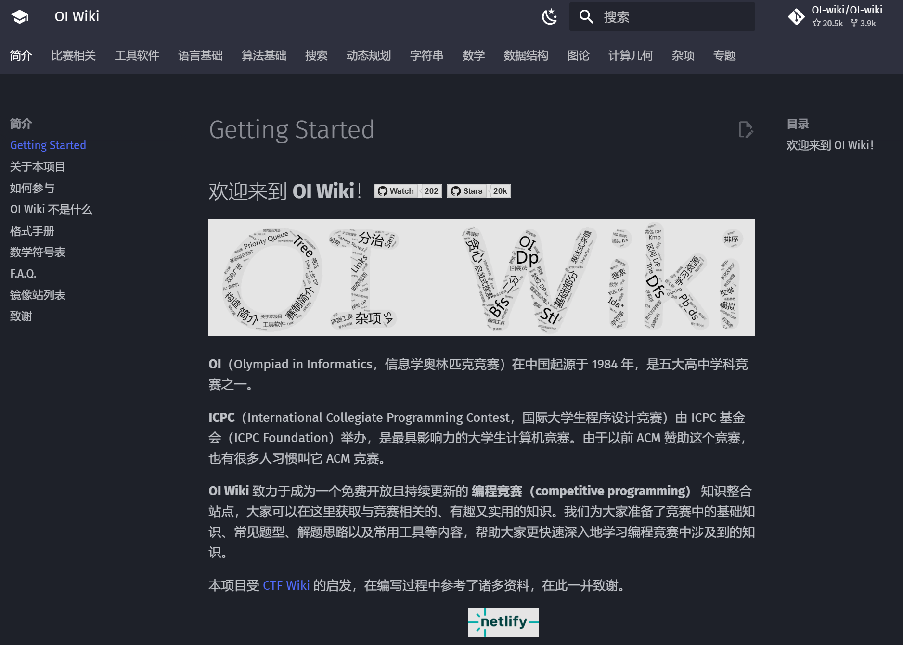

## 考研机试
["N诺" 计算机考研机试：高分篇、满分篇](https://noobdream.com/Major/majorinfo/23/)
## 算法参考资料
### Hello-algo
[Hello-algo](https://www.hello-algo.com/)

### oi wiki
[oi wiki](https://oi-wiki.org/)

### 算法cs61b
[cs61b](https://inst.eecs.berkeley.edu/~cs61b/sp22/)
### 一本不错的题解 leetcode 101
https://viterbi-web.usc.edu/~yudewei/main/sources/books/LeetCode%20101%20-%20A%20LeetCode%20Grinding%20Guide%20(C++%20Version).pdf
### LeetCodeAnimation
https://github.com/MisterBooo/LeetCodeAnimation
## 高校学生自发文档
[CSwiki](https://csdiy.wiki/)
[清华计算机系科协技能文档](https://docs.net9.org/)
[酒井科协暑培2024](https://summer24.net9.org/)
[酒井科协暑培2023](https://summer23.net9.org/)
[好用的标签页iTab](https://www.itab.link/)
[浙大本科生指南](https://zjuers.com/welcome/)
[复旦本科生指南](https://fudanmanual.github.io/FudanManual/Intro/)

[上海交通大学本科生指南](https://github.com/THUwangshiyuan/BUAA-Course-Review)

## 《算法设计与分析基础》

**重要的问题类型**

 - **排序**：就是把一堆乱序的数据按照特定的顺序（比如从小到大、从大到小）排列好。例如，将数字[5, 3, 1, 4, 2]排成[1, 2, 3, 4, 5]。
 - **查找**：在一堆数据里找到你想要的那个数据。就像在图书馆的很多书里找到你想看的那一本。
 - **字符串处理**：对由字符组成的字符串进行操作，比如判断一个字符串是不是另一个字符串的子串，或者把几个字符串拼接在一起等。

**基本数据结构**

 - **树**：想象一棵树，有根、有分支、有叶子。在数据结构里，树有节点，节点之间有父子关系，它可以用来表示层次结构的数据。比如公司的组织架构，董事长在最上面，下面是各个部门经理等。
 - **图**：由一些点（顶点）和连接这些点的线（边）组成。可以用来表示很多实际的网络关系，比如城市之间的道路连接情况。
 - **列表**：就是把数据一个一个按顺序排好，像购物清单一样。
 - **集合**：它里面的元素没有特定的顺序，而且每个元素都是唯一的，就像把不同的水果放在一个篮子里，每种水果只放一个。

**算法效率分析（可以先跳过不看）**：这个部分是研究算法运行的快慢和占用内存空间的多少。

**蛮力法**：简单来说，就是不考虑技巧，用最直接、最笨的方法去解决问题。比如要在一个房间里找钥匙，蛮力法就是把房间里所有的东西都翻一遍。

**减治法**：把一个大问题逐步分解成规模较小的子问题，然后解决这些子问题，最后再把这些子问题的结果组合起来得到大问题的答案。就好像要吃一个大蛋糕，先把它切成小块，吃完小块再知道整个蛋糕的味道。

**分治法**：把一个大问题分成几个差不多大小的子问题，分别解决这些子问题，最后把它们的结果合并起来。和减治法有点像，但分治法的子问题通常规模比较均匀。

**变治法**：通过改变问题的表现形式或者性质来使问题更容易解决。

**时空权衡**：有时候为了让算法运行得更快（节省时间），可能需要占用更多的内存空间；或者为了节省内存空间，算法运行的速度就会慢一些。这就是在时间和空间之间进行权衡。

**动态规划**

 - **动态规划**：是一种解决多阶段最优化问题的方法。它把一个复杂的问题分解成多个简单的子问题，并且把这些子问题的结果保存起来，这样在遇到相同的子问题时就不用再重新计算了。

 - **背包问题和记忆功能**
    - **背包问题**：想象你有一个背包，它能装一定重量的东西，现在有很多不同重量和价值的物品，你要选择一些物品放进背包，使得背包里物品的总价值最大。
    - **记忆化**：在解决背包问题的时候，把已经计算过的子问题的结果保存起来，下次再遇到同样的子问题就直接使用这个结果，不用再计算一遍，这就是记忆化。
 - **最优二叉查找树**：二叉查找树是一种特殊的树结构，在这种树里查找数据很方便。最优二叉查找树就是在所有可能的二叉查找树中，让查找操作的平均成本最小的那棵树。
 - **Floyd 算法**：主要用于解决图中任意两点之间的最短路径问题。它通过不断更新两点之间的距离来找到最短路径。
 - **Warshall 算法**：用于求图的传递闭包，简单说就是确定图中任意两个顶点之间是否存在路径。

**贪婪算法**

 - **Prim 算法**：用于在图中找到一棵最小生成树。它从一个顶点开始，每次都选择一条与当前生成树相连的最小权重的边，把新的顶点加入到生成树中。
 - **Kruskal 算法**：也是求图的最小生成树的算法。它把图中的边按照权重从小到大排序，然后依次选择边，如果这条边加入后不会形成环，就把它加入到最小生成树中。
 - **Dijkstra 算法**：用于在图中计算一个顶点到其他所有顶点的最短路径。它从一个起始顶点开始，每次找到距离起始顶点最近的一个顶点，然后更新这个顶点的邻居顶点到起始顶点的距离。

**算法分类（第 4 - 10 章）**

 - **蛮力法**：直接按最基本的方法尝试所有可能性。
 - **减治法**：逐步减小问题规模求解。
 - **分治法**：均匀划分问题为子问题求解。
 - **变治法**：改变问题形式求解。
 - **时空权衡**：平衡算法运行时间和占用空间。
 - **动态规划**：利用子问题结果优化求解过程。
 - **贪婪**：在每一步都选择局部最优的策略。
 - **算法的极限**：研究算法在解决某些问题上的能力边界。
 - **超越算法的极限**：可能是探讨一些突破传统算法限制的方法或者思路。
 - **霍夫曼树**：是一种特殊的二叉树，用于数据压缩等领域。它根据字符出现的频率来构建树，频率高的字符离根节点近，这样可以更有效地进行编码和解码。

## 《数据结构解题策略》
复旦大学吴永辉
### 线性表的解题策略

### 树的解题策略

### 图的解题策略

