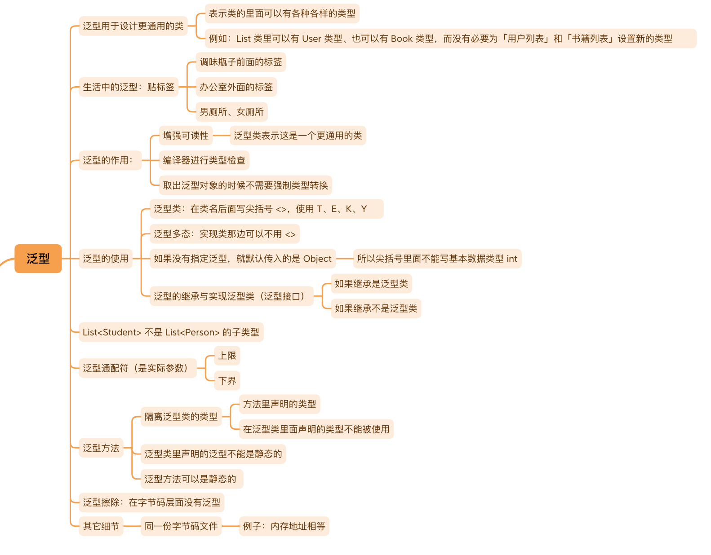

# Java Basic
## ch1 enumeration

## ch2 annotation

## ch3 generics

## ch4 functional programming and streaming

## ch5 multithreaded foundation

## ch6 date time

# Java Advanced
## JUC(java.util.concurrent)

## JVM(java virtual machine)

## NIO

## reflection

# Java framework

## Redis

## RocketMQ

# Computer Bases

## Design patterns

